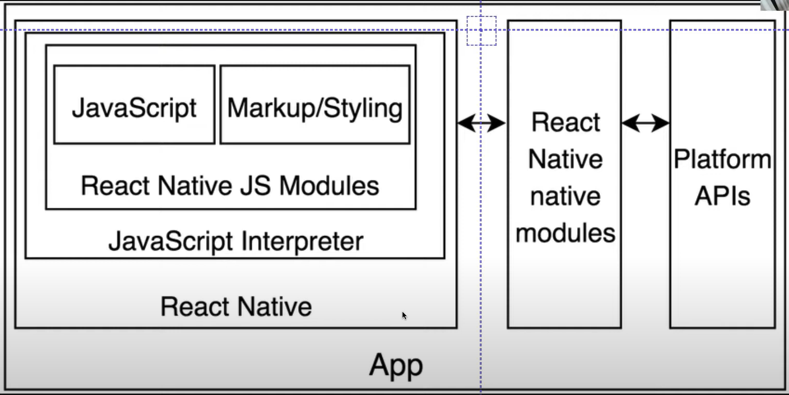

# 1. React-Native 핵심 인프라

React-Native에서 가장 중요한 부분은 **Bridge**를 통해 코드가 운영체제와 통신할 수 있도록 하는 인프라 시설이다.

### 주요 React-Native 인프라 구성 요소

- **JavaScript**: 앱의 로직을 처리하는 코드
- **Markup/Styling**: UI를 구성하는 마크업과 스타일링
- **React-Native JS Module**: React-Native의 기능을 제공하는 모듈
- **JavaScript Interpreter**: JavaScript 코드를 해석하는 엔진
- **React-Native**: JavaScript와 네이티브 환경을 연결하는 핵심 라이브러리
- **React-Native Native Modules**: 네이티브 코드와 상호작용할 수 있게 도와주는 모듈
- **Platform APIs**: iOS와 Android에서 제공하는 네이티브 API들

---

# 2. React-Native의 작동 방식

## 2.1 React-Native의 역할

React-Native에는 **브라우저**가 없다. 예를 들어, iOS 또는 Android에게 "버튼을 그려주세요"라고 요청하면, React-Native는 직접 버튼을 만들지 않는다. 대신, iOS와 Android에게 버튼을 만들어 달라는 메시지를 보낸다. React-Native는 **번역기(compile**)와 같은 역할을 한다.

즉, React-Native는 인터페이스로서, 우리가 작성한 JavaScript 코드가 **iOS** 또는 **Android** 네이티브 코드로 변환되도록 한다. 이 과정에서 **Java**와 **Xcode**가 필요하다. 앱의 모든 기능은 Java로 작성되기 때문에, 이를 처리할 수 있는 도구들이 필요하다.

## 2.2 React-Native 앱 다운로드 및 기본시설

React-Native 앱을 다운로드할 때, **JavaScript 코드만** 다운로드되는 것이 아니다. 이 앱은 **JavaScript 코드가 실행될 수 있도록 필요한 모든 기본 인프라**를 포함한 상태로 다운로드된다.

- **기본 인프라**: 이 인프라는 **JavaScript 코드**가 운영체제와 통신할 수 있도록 변환하고 컴파일하는 역할을 한다.
- **컴파일 과정**: React-Native 앱을 실제로 빌드할 때는 **Xcode**, **Android Studio**, **Java**와 같은 도구를 사용하여 **apk**와 **ipa** 파일을 생성한다. 이 과정에서 **JavaScript 코드**와 **네이티브 코드**가 결합되어 실행 가능한 형태로 패키징된다.

따라서, React-Native 앱을 빌드하고 실행하려면 **Java**와 **Xcode**가 설치되어 있어야 한다. 이는 앱이 네이티브 환경에서 제대로 실행되기 위한 필수적인 도구들이다.

## 2.3 Expo의 장점

### Expo를 사용하는 이유

React-Native로 앱을 개발할 때 초기 설정이 복잡하다. **Java**나 **Xcode**와 같은 도구들을 설치하고 환경을 설정해야 하기 때문이다.

- **Expo**는 프로젝트를 생성하면 모든 인프라를 자동으로 설정해준다. 따라서, **Java**나 **Xcode**를 설치할 필요 없이 개발을 시작할 수 있어 진입장벽이 낮다.
- Expo를 사용하면 **폰에서 즉시** 코드를 테스트할 수 있다. 즉, React-Native 코드를 작성한 후 바로 폰으로 전송하여 실시간으로 결과를 확인할 수 있다.

### Expo 오류 해결 방법

Expo와 같은 개발 도구들은 경로나 환경 설정에 민감하기 때문에, 경로에 한글과 같은 비ASCII 문자가 포함되지 않도록 하는 것이 중요하다. C 드라이브에 영문 경로를 사용하는 방식이 가장 안전한 해결책이다.

**npx expo start**로 핸드폰과 expo go가 연결이 안된다면 **npx expo start --tunnel**로 해결이 된다.

---

# 3. React-Native의 규칙

1. **React-Native는 웹사이트가 아니다**  
   HTML이 아니기 때문에 `div` 태그는 사용할 수 없다. 대신, `View`를 사용한다. 또한 항상 import 해야 한다.

   예) `import { StyleSheet, Text, View } from 'react-native';`

2. **모든 텍스트는 `<Text>` 컴포넌트 안에 있어야 한다.**  
   예) `<Text>Hello World!</Text>`

3. **StyleSheet.create는 객체를 생성하는 데 사용된다.**

   - 사용하는 이유:
     1. 자동 완성 기능을 제공
     2. 스타일이 거대해지는 것을 방지 (일반적으로 스타일은 `StyleSheet`에 구분하여 작성하고, 컴포넌트는 위에 배치한다.)

4. **Status-bar**  
   상태 표시줄은 **시계**, **배터리**, **Wi-Fi** 상태 등을 포함한다.
